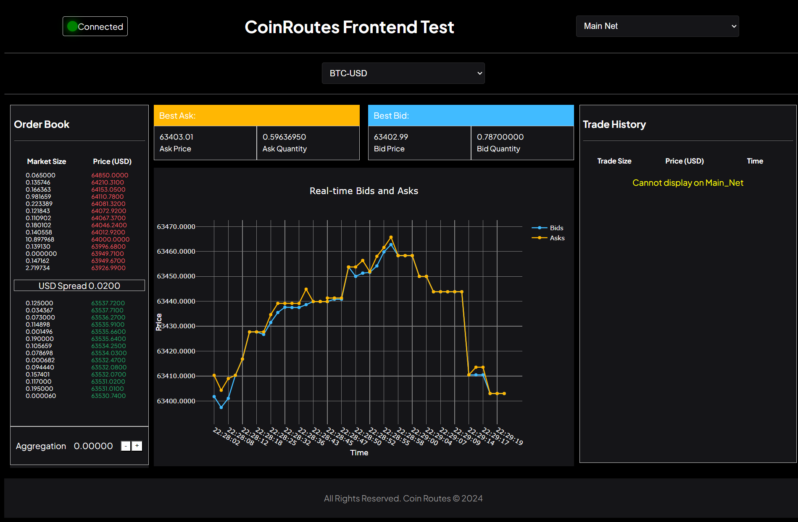

# CoinRoutes Front-end Test

### How to use

## Run Locally  
Clone the project  

~~~bash  
  git clone https://github.com/mr-muhammad-rehan/coinRoutes-frontend.git
~~~

Go to the project directory  

~~~bash  
  cd coinRoutes-frontend
~~~

Install dependencies  

~~~bash  
npm install
~~~

Start the server  

~~~bash  
npm run dev
~~~  

# Screen

